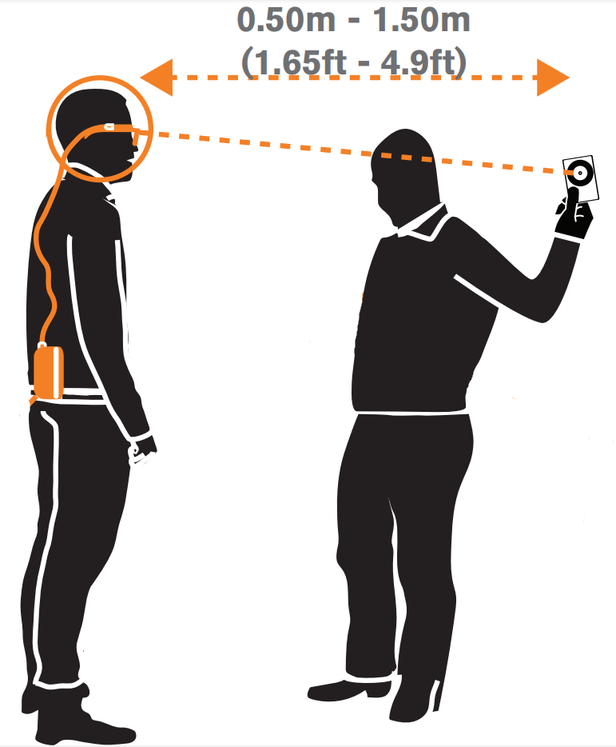

# Backend

A program to connect to a dashboard with a session token, retrieve data from either devices or a dataset, compute different multimodal data variables and send the results to the connected dashboard in real-time.

## Prerequisites

To run the program, the following is required:

- [Python 3.6](https://www.python.org/downloads/)
- [Pipenv](https://github.com/pypa/pipenv)

## Installation

In the `backend/` folder, install all dependencies needed:

```bash
pipenv install
```

## Run The Tests

Run the following command while being in the backend-root folder:

```
pipenv run pytest
```

## Run the Program

Start the virtual environment from the `backend/` folder:

```
pipenv shell
```

Run the program from the `backend/` folder:

```
python main.py SESSION_CODE [OPTIONS]
```

Options:

- --devices EYE_TRACKER
  - Retrieve data from devices
  - Devices must be set up correctly; see the [devices setup](#devices-setup) section below
  - EYE_TRACKER is the type of eye tracker used, either _stationary_ or _mobile_ (see examples [below](#example:-run-with-devices))
- --dataset=[id]
  - Retrieve data from a dataset (1-15).

If no options are specified, dataset 1 will be used.

### Example: Run with Dataset 12

```
python main.py SESSION_CODE --dataset=12
```

### Example: Run with Devices

Before launching, make sure all devices are connected and up and running.

If stationary eye tracker is used:

```
python main.py SESSION_CODE --devices stationary
```

If mobile eye tracker is used:

```
python main.py SESSION_CODE --devices mobile
```

## Devices Setup

If you want to run the program using a dataset, you can ignore this section. If you want to run the program with actual devices, these must be set up and configured correctly to be able to communicate with the program.

Devices needed:

- Tobii Pro X3-120 (stationary eye tracker) **or** Tobii Pro Glasses 2 (mobile eye tracker)
- Empatica E4 (wristband)
- HD camera

The following subsections will cover how to set these up correctly to be used with the program.

### Tobii Pro X3-120 (Stationary Eye Tracker)

_Note_: Calculations derived from stationary eye tracker data assumes that
the screen is **14"** with **16:9 aspect ratio** (can be changed at `devices/eye_tracker/stationary_eye_tracker.py:19`).

#### Installation

1. Install the official [Eye Tracker Manager](https://www.tobiipro.com/product-listing/eye-tracker-manager/) from Tobii Pro.
2. Run the installed program and follow the instructions on the screen. When asked, install the drivers for the correct eye tracker (Tobii Pro X3-120).

#### Usage

1. Connect the eye tracker to the computer by USB.
2. Make sure the eye tracker is calibrated by pressing the "Calibrate" button in the Eye Tracker Manager for the correct eye tracker and follow the instructions.
3. Close the Eye Tracker Manager (not necessary to have this open during program execution).

### Tobii Pro Glasses 2 (Mobile Eye Tracker)

To connect to the mobile eye tracker, you need two network connections.

1. Connect to the network that the Tobii recording unit is broadcasting. The network's default name is the serial number of the unit.
2. Connect to the internet with an ethernet cable. Since you need to be able to send device data to the teacher, this is a requirement.

An Example of such a setup:


When you start the backend, you will be prompted to start a calibration of the glasses. To do this successfully, press "Enter" and lock your eyes on the black ring on the white card that comes with the glasses. When calibrating, this card should be 0.5-1.5 metres away from viewer.



### Empatica E4 (wristband)

#### Installation

1. Create an account and log in to https://www.empatica.com/connect/login.php.
2. Go to https://www.empatica.com/connect/developer.php.
3. Click on the "Become a developer" button.
4. Copy the API key.
5. Make sure your device is connected to your profile, by entering the purchase code.
6. Install the E4 Streaming Server from [here](http://developer.empatica.com/windows-streaming-server-usage.html). Make sure you have all requirements fulfilled.
7. Plug in the Bluetooth dongle (USB) to the computer.
8. Launch the E4 Streaming Server.
9. Paste in the API key when prompted.
10. Go to the settings tab and check that the [correct configuration](../documentation/e4_streaming_server_settings.png) is made.

#### Usage

1. Start the E4 Streaming Server.
2. Follow the guide from [here](https://developer.empatica.com/windows-streaming-server-usage.html) to connect the wristband to the E4 Streaming Server over Bluetooth (under _Using the server_ and _Connecting an E4_). Make sure the wristband is connected to the server before starting the program. The E4 Streaming Server must be open during program execution.

### HD Camera: OpenFace (if stationary eye tracker is used)

The installation guide is taken from the [OpenFace github](https://github.com/TadasBaltrusaitis/OpenFace/wiki/Windows-Installation).

#### Requirements:

1. Windows 64-bit operating systetm
2. 64-bit Visual C++ redistributable package, that can be found [here](https://aka.ms/vs/16/release/vc_redist.x64.exe)

#### 1. Install OpenFace Binaries

Install the binaries from [here](https://github.com/TadasBaltrusaitis/OpenFace/releases/download/OpenFace_2.2.0/OpenFace_2.2.0_win_x64.zip).

Move the contents of the unzipped file (not including the folder the files are in) to a new folder called `bin` under `backend/devices/openface/`.

#### 2. Download Models

Run the following command from `backend/devices/openface/bin/`:

```
powershell -noexit -executionpolicy bypass -File download_models.ps1
```

### HD Camera: OpenPose (if mobile eye tracker is used)

#### Requirements:

1. Windows 64-bit operating systetm
2. 64-bit Visual C++ redistributable package, that can be found here: https://aka.ms/vs/16/release/vc_redist.x64.exe

#### 1. Install OpenPose Binaries

Install the binaries from [here](https://github.com/CMU-Perceptual-Computing-Lab/openpose/releases/download/v1.7.0/openpose-1.7.0-binaries-win64-cpu-python3.7-flir-3d.zip).

Move the contents of the unzipped file (not including the folder the files are in) to a new folder called `bin` under `backend/devices/openpose/`.

#### 2. Download Models

Run the following command from `backend/devices/openpose/bin/models`:

```
getBaseModels.bat
```
