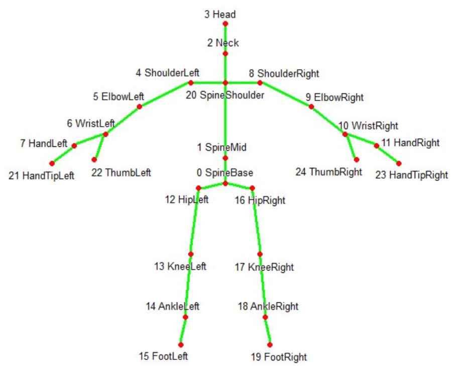
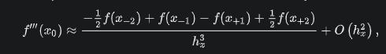

Eye-tracking data
=================

Eye.movement.type.index 🡺 fixation ID

initTime 🡺 fixation start time milliseconds

endTime 🡺 fixation end time milliseconds

lpup 🡺 left pupil diameter

rpup 🡺 right pupil diameter

fx🡺 fixation x-coordinate on the video

fy🡺 fixation y-coordinate on the video

The saccade length can be inferred as the Euclidean distance between the two fixations and the same is for the saccade duration.

If Pupil diameter is NA it can be replaced with the other pupil diameter. If both are NA use the previous diameter.

For Cognitive load use this paper: [https://dl.acm.org/doi/pdf/10.1145/3313831.3376394?casa\_token=Iv6GjF1lZBgAAAAA:\_rk95bvQKtzGZ\_0oHbj0KdsrCMZA-GqaRF5Y-YSc9Z\_HFXzn-Yyhz86wg9\_McV3pafKL2XGzRBNO](https://www.google.com/url?q=https://dl.acm.org/doi/pdf/10.1145/3313831.3376394?casa_token%3DIv6GjF1lZBgAAAAA:_rk95bvQKtzGZ_0oHbj0KdsrCMZA-GqaRF5Y-YSc9Z_HFXzn-Yyhz86wg9_McV3pafKL2XGzRBNO&sa=D&source=editors&ust=1619955784055000&usg=AOvVaw3so8YBc44EQk9y2sXioev6)

For Info processing index and anticipation: see the attached presentation.

For Info perceived difficulty (PD):

1.  saccade speed = saccade length/saccade duration
2.  PD = 1/(1+saccade speed)

For Focus use this paper: [https://www.sciencedirect.com/science/article/pii/S1071581920301518](https://www.google.com/url?q=https://www.sciencedirect.com/science/article/pii/S1071581920301518&sa=D&source=editors&ust=1619955784057000&usg=AOvVaw0VSaG8QGL-sQ5Fo1rYApwq)

* * *

Skeleton data
=============

X,y,z 🡺 coordinates of the three joints.

Time 🡺 timestamp seconds

Joint 🡺 joint ID (see the image below)

Fatigue 🡺 see the attached presentation

Amount of Motion 🡺 the total distance travelled by each joint, compute the Euclidean distance between the two consecutive positions of each joint and average it over the whole body.

Stability of Motion 🡺 compute the Euclidean distance between the two consecutive positions of each joint 🡺 compute 1/(1+distance) and then sum it over the whole body.

EDA/HR data ++
==============

*   .csv files are in the following format:
*   The first row is the initial time of the session expressed as unix timestamp in UTC.
*   The second row is the sample rate expressed in Hz.

TEMP.csv

*   Data from temperature sensor expressed degrees on the Celsius (°C) scale.

EDA.csv

*   Data from the electrodermal activity sensor expressed as microsiemens (μS).

BVP.csv

*   Data from photoplethysmograph. You can ignore this if you want

ACC.csv

*   Data from 3-axis accelerometer sensor. The accelerometer is configured to measure acceleration in the range \[-2g, 2g\]. Therefore the unit in this file is 1/64g.
*   Data from x, y, and z axis are respectively in first, second, and third column.

IBI.csv

*   Time between individuals heart beats extracted from the BVP signal.
*   No sample rate is needed for this file.
*   The first column is the time (respect to the initial time) of the detected inter-beat interval expressed in seconds (s).
*   The second column is the duration in seconds (s) of the detected inter-beat interval (i.e., the distance in seconds from the previous beat).

HR.csv

*   Average heart rate extracted from the BVP signal.The first row is the initial time of the session expressed as unix timestamp in UTC.
*   The second row is the sample rate expressed in Hz.
